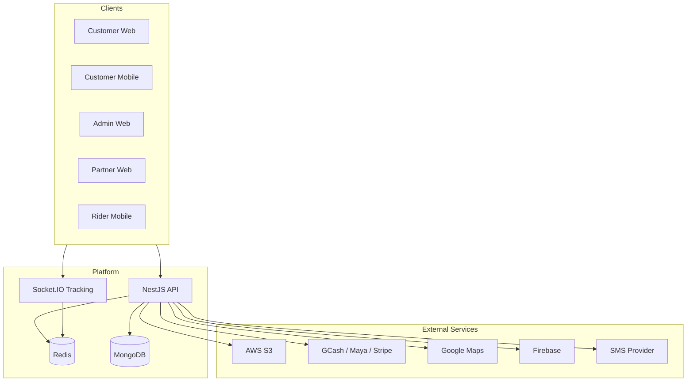

# Lunara Architecture

## System Overview



## Monorepo Layout

- **apps/** — Deployable applications (API, web, mobile)
- **packages/** — Shared libraries consumed by apps
- **docs/** — Architecture and API documentation

## Backend (NestJS)

Modular domain-driven structure:

```
apps/api/src/
├── common/          # Guards, decorators, filters
├── modules/
│   ├── auth/        # JWT, OTP, OAuth
│   ├── users/
│   ├── orders/
│   ├── partners/
│   ├── riders/
│   ├── payments/
│   ├── notifications/
│   └── realtime/    # Socket.IO tracking
```

## Event-Driven Design

| Event | Publisher | Consumers |
|-------|-----------|-----------|
| `order.created` | Orders | Notifications, Analytics |
| `order.status_changed` | Orders | Realtime, Rider dispatch |
| `payment.completed` | Payments | Wallet, Notifications |
| `rider.location_updated` | Realtime | Customer tracking |

Use Redis pub/sub or a message broker (Bull/BullMQ) for async processing.

## Real-Time Tracking

1. Rider app emits `riderLocation` via Socket.IO namespace `/tracking`
2. Customers join room `order:{orderId}`
3. Gateway broadcasts `locationUpdate` to room
4. Order status changes emit `orderStatusUpdate`

## RBAC

Permissions defined in `@lunara/utils` (`permissions.ts`). JWT payload includes `role` and `permissions[]`. NestJS `RolesGuard` + `@Roles()` decorator enforce route access.

## Deployment

| Service | Target |
|---------|--------|
| API | AWS ECS / Railway / Fly.io |
| Web | Vercel |
| Mobile | EAS Build → App Store / Play Store |
| MongoDB | MongoDB Atlas |
| Redis | Upstash / ElastiCache |
| Files | S3 + Cloudflare CDN |
