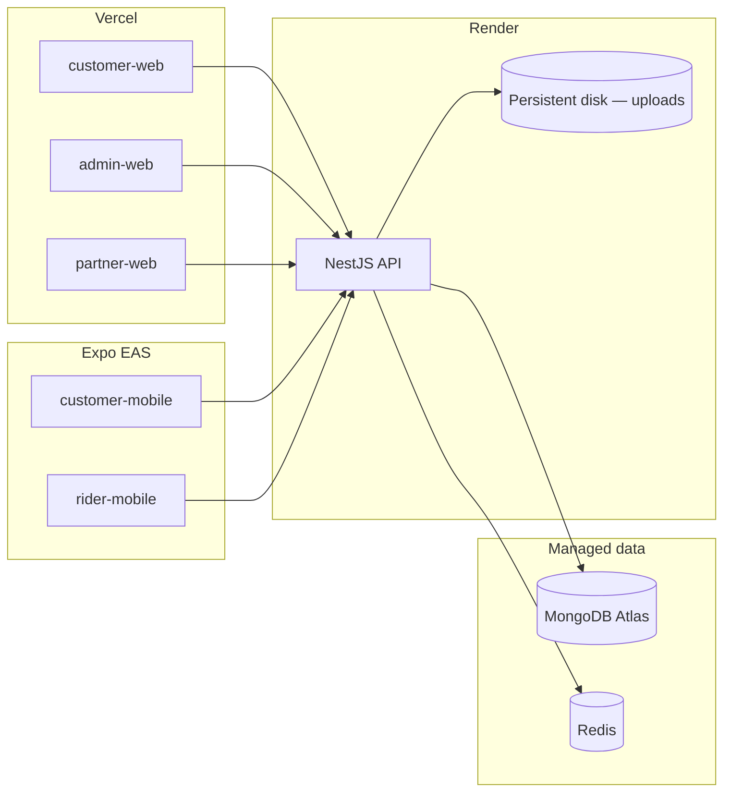

# Lunara Deployment Guide

This guide covers deploying Lunara to production with:

| Layer | Platform | Apps |
|-------|----------|------|
| **Backend** | [Render](https://render.com) | NestJS API (`apps/api`) |
| **Web frontends** | [Vercel](https://vercel.com) | Customer, Admin, Partner (`apps/*-web`) |
| **Mobile** | [Expo EAS](https://expo.dev/eas) | Customer & Rider apps (see [Mobile apps](#mobile-apps-expo-eas)) |

Managed services you provision separately:

- **MongoDB** — [MongoDB Atlas](https://www.mongodb.com/atlas) (recommended)
- **Redis** — Render Key Value, [Upstash](https://upstash.com), or Redis Cloud
- **Firebase** — Push notifications (optional but recommended for mobile)
- **Domain DNS** — Custom domains on Render and Vercel

---

## Architecture



**API base path:** all REST routes live under `/api/v1`.  
**Health check:** `GET /api/v1/health`  
**WebSockets:** Socket.IO namespace `/tracking` on the same origin as the API (Render Web Services support WebSockets).

---

## Prerequisites

- Node.js **20+** (repo `engines` requirement)
- GitHub (or GitLab) repo connected to Render and Vercel
- MongoDB Atlas cluster (M10+ recommended for production)
- Redis instance reachable from Render
- Strong secrets for JWT (the API **refuses to start** in production without them)

---

## 1. MongoDB Atlas

1. Create a cluster and database user with read/write access.
2. Network access: allow Render outbound IPs, or `0.0.0.0/0` during initial setup (tighten later).
3. Copy the connection string:

```bash
MONGODB_URI=mongodb+srv://<user>:<password>@<cluster>.mongodb.net/lunara?retryWrites=true&w=majority
```

4. After the API is live, run the seed script once (see [Post-deploy](#6-post-deploy-checklist)) to create admin, partner, and rider dev accounts — **change passwords immediately** in production.

---

## 2. Redis

The API uses Redis for caching, sessions, and Socket.IO scaling hooks. Set:

```bash
REDIS_URL=redis://default:<password>@<host>:6379
```

**Render Key Value:** create a Redis instance in the same region as the API and paste the internal URL into `REDIS_URL` on the API service.

**Upstash:** use the `rediss://` URL if TLS is enabled; `ioredis` supports both.

---

## 3. Backend — Render (Web Service)

Deploy `apps/api` as a **Web Service**. Two supported approaches:

### Option A — Docker (recommended)

Uses the repo Dockerfile at `docker/api.Dockerfile`.

| Setting | Value |
|---------|--------|
| **Environment** | Docker |
| **Root directory** | *(repo root — leave blank)* |
| **Dockerfile path** | `docker/api.Dockerfile` |
| **Health check path** | `/api/v1/health` |

Render sets `PORT` automatically; the API reads `process.env.PORT ?? 3001`.

### Option B — Native Node

| Setting | Value |
|---------|--------|
| **Environment** | Node |
| **Root directory** | *(repo root)* |
| **Build command** | See below |
| **Start command** | `node apps/api/dist/main.js` |
| **Health check path** | `/api/v1/health` |

**Build command (native):**

```bash
npm ci \
  && npm run build --workspace=@lunara/types \
  && npm run build --workspace=@lunara/utils \
  && npm run build --workspace=@lunara/validation \
  && npm run build --workspace=@lunara/api
```

> **Do not use `npm run build` at the repo root on Render.** That runs Turbo across every app with a `build` script (Next.js web apps, API, etc.). Mobile apps are built with **EAS** (`npm run eas:build --workspace=@lunara/rider-mobile`), not on Render. Prefer **Option A (Docker)** or the scoped build command above. A [`render.yaml`](../render.yaml) blueprint is included for Docker deploy.

### API environment variables (Render)

Set these in the Render service **Environment** tab.

#### Required

| Variable | Description |
|----------|-------------|
| `NODE_ENV` | `production` |
| `MONGODB_URI` | Atlas connection string |
| `REDIS_URL` | Redis connection URL |
| `JWT_SECRET` | Long random string (≥ 32 chars) |
| `JWT_REFRESH_SECRET` | Different long random string |
| `JWT_EXPIRES_IN` | e.g. `7d` |
| `JWT_REFRESH_EXPIRES_IN` | e.g. `30d` |

#### Recommended

| Variable | Description |
|----------|-------------|
| `API_URL` | Public API URL, e.g. `https://api.lunara.example.com` |
| `CUSTOMER_WEB_URL` | Customer site URL (used in emails/links) |

#### Optional integrations

| Variable | When needed |
|----------|-------------|
| `FIREBASE_PROJECT_ID`, `FIREBASE_CLIENT_EMAIL`, `FIREBASE_PRIVATE_KEY` | Mobile push (FCM) |
| `GOOGLE_MAPS_API_KEY` | Distance / routing features |
| `STRIPE_SECRET_KEY`, `GCASH_MERCHANT_ID`, `MAYA_PUBLIC_KEY` | Live payments |
| `TWILIO_*`, `SMTP_HOST`, `SMTP_USER`, `SMTP_PASS` | SMS / email |
| `GOOGLE_CLIENT_ID`, `GOOGLE_CLIENT_SECRET`, `FACEBOOK_*` | OAuth login |

See [`.env.example`](../.env.example) for the full list.

**Firebase private key on Render:** paste the key with literal `\n` for newlines, or use Render’s multiline secret field.

### File uploads (important)

The API stores uploads on the local filesystem under `uploads/` (avatars, rider KYC documents, task photos). Render’s default filesystem is **ephemeral** — files are lost on redeploy.

**Production options:**

1. **Render persistent disk (simplest)** — Attach a disk mounted at `/app/uploads` (Docker) or the app working directory, and ensure `uploads/` resolves there. Minimum 1 GB; scale as needed.
2. **Object storage (future)** — `.env.example` includes AWS S3 / Cloudinary placeholders; wire these before relying on uploads at scale across multiple instances.

Until object storage is implemented, use a **single API instance** plus persistent disk, or accept that uploads reset on deploy.

### WebSockets

No extra Render configuration is required. Frontends connect to:

```
wss://<your-api-host>/tracking
```

Ensure `NEXT_PUBLIC_API_URL` (Vercel) and `EXPO_PUBLIC_API_URL` (mobile) point at the same API host.

### Custom domain (API)

1. Render → your Web Service → **Settings → Custom Domains**
2. Add e.g. `api.lunara.example.com`
3. Create the CNAME record Render provides
4. Update `API_URL`, `NEXT_PUBLIC_API_URL`, and mobile env vars to the new domain

---

## 4. Web frontends — Vercel

Deploy **three separate Vercel projects** from the same monorepo — one per Next.js app.

| Vercel project | Root directory | Suggested domain |
|----------------|----------------|------------------|
| Customer web | `apps/customer-web` | `app.lunara.example.com` or `lunara.example.com` |
| Admin web | `apps/admin-web` | `admin.lunara.example.com` |
| Partner web | `apps/partner-web` | `partner.lunara.example.com` |

### Connect the repo

1. Import the Git repository in Vercel.
2. For each project, set **Root Directory** to the app folder above.
3. Framework preset: **Next.js** (auto-detected).

### Build settings

Vercel detects the Turborepo layout via `turbo.json`. For each project:

| Setting | Value |
|---------|--------|
| **Install command** | `cd ../.. && npm ci` |
| **Build command** | `cd ../.. && npx turbo run build --filter=@lunara/<app-name>` |

Replace `<app-name>` with `customer-web`, `admin-web`, or `partner-web`.

Turbo builds workspace dependencies (`@lunara/types`, `@lunara/utils`, `@lunara/config`, `@lunara/hooks`, etc.) automatically via `dependsOn: ["^build"]`.

**Alternative build command** (without Turbo filter):

```bash
cd ../.. \
  && npm run build --workspace=@lunara/types \
  && npm run build --workspace=@lunara/utils \
  && npm run build --workspace=@lunara/config \
  && npm run build --workspace=@lunara/hooks \
  && npm run build --workspace=@lunara/<app-name>
```

(Omit the `@lunara/hooks` line for `partner-web`.)

### Environment variables (Vercel)

Set per project in **Settings → Environment Variables**. Apply to **Production** (and Preview if you use staging APIs).

| Variable | Example | Notes |
|----------|---------|-------|
| `NEXT_PUBLIC_API_URL` | `https://api.lunara.example.com` | With or without `/api/v1` — hooks normalize automatically |

Each app’s `next.config.ts` loads the monorepo root `.env` in local dev; on Vercel, set vars in the dashboard (they are inlined at **build time**).

**After changing `NEXT_PUBLIC_API_URL`, redeploy** — Next.js bakes public env vars into the client bundle.

### CORS

The API enables CORS with `origin: true` and `credentials: true`, so Vercel preview and production domains work without an allowlist. Tighten this in `apps/api/src/main.ts` if you require a fixed origin list.

### Preview deployments

For PR previews, either:

- Point preview env `NEXT_PUBLIC_API_URL` at a **staging API** on Render, or
- Share the production API (not recommended for write-heavy testing)

---

## 5. Environment variable matrix

Quick reference for cross-service wiring after deploy:

| Variable | Set on | Example |
|----------|--------|---------|
| `MONGODB_URI` | Render (API) | Atlas URI |
| `REDIS_URL` | Render (API) | Redis URL |
| `JWT_SECRET`, `JWT_REFRESH_SECRET` | Render (API) | Secrets |
| `API_URL` | Render (API) | `https://api.lunara.example.com` |
| `CUSTOMER_WEB_URL` | Render (API) | `https://lunara.example.com` |
| `NEXT_PUBLIC_API_URL` | Vercel (all 3 web apps) | Same as `API_URL` |
| `EXPO_PUBLIC_API_URL` | EAS / Expo | Same as `API_URL` |
| `FIREBASE_*` | Render (API) | Service account for push |

---

## 6. Post-deploy checklist

### Verify API

```bash
curl https://<api-host>/api/v1/health
```

Expected: `"status":"ok"` with `"checks":{"mongo":"ok","redis":"ok"}`.

### Seed initial data (first deploy only)

From your machine with network access to Atlas:

```bash
MONGODB_URI="mongodb+srv://..." \
JWT_SECRET="..." \
JWT_REFRESH_SECRET="..." \
NODE_ENV=production \
npm run seed --workspace=@lunara/api
```

Then **rotate or disable** default seed passwords (`password123`) before going live.

### Verify each web app

1. Open each Vercel URL → login page loads.
2. Sign in (admin: `admin@lunara.dev` after seed — change password).
3. Confirm API calls succeed (browser Network tab → requests to `/api/v1/...`).
4. Open **Dispatch** or **Control Tower** (admin) — WebSocket status should connect (live updates without refresh).

### Verify mobile (if applicable)

1. Set `EXPO_PUBLIC_API_URL` in EAS secrets to the Render API URL.
2. Build with EAS production profile.
3. Test login, booking, and realtime order tracking.

---

## 7. Mobile apps (Expo EAS)

Mobile apps are **not** deployed to Vercel. Use [EAS Build](https://docs.expo.dev/build/introduction/) and app store submission.

| App | Directory | EAS config |
|-----|-----------|------------|
| Customer | `apps/customer-mobile` | `apps/customer-mobile/eas.json` |
| Rider | `apps/rider-mobile` | `apps/rider-mobile/eas.json` |

**Production env (EAS secrets):**

```bash
eas secret:create --name EXPO_PUBLIC_API_URL --value https://api.lunara.example.com
```

Configure Firebase credentials on the **API** (Render) for background push. See [README — Push notifications](../README.md#push-notifications-firebase--eas).

---

## 8. Staging environment (optional)

| Component | Suggestion |
|-----------|------------|
| API | Second Render Web Service (`lunara-api-staging`) |
| MongoDB | Separate Atlas database or cluster |
| Redis | Separate instance |
| Vercel | Use **Preview** env vars → staging API |
| Mobile | EAS `preview` build profile |

Keep staging JWT secrets and MongoDB isolated from production.

---

## 9. Operations

### Logs

- **Render:** Dashboard → Service → Logs (API stdout/stderr)
- **Vercel:** Dashboard → Project → Deployments → Function logs

### Redeploy

- **API:** Push to the connected branch, or **Manual Deploy** on Render
- **Web:** Push triggers Vercel; Turbo cache speeds rebuilds

### Scaling

| Concern | Guidance |
|---------|----------|
| API CPU/memory | Start with Render Standard; scale instance type under load |
| Multiple API instances | Requires shared upload storage (S3) and Redis-backed Socket.IO adapter |
| MongoDB | Atlas auto-scaling or tier upgrade |
| Vercel | Serverless scales automatically; no action needed for typical admin/partner traffic |

### Backups

- **MongoDB Atlas:** enable continuous backup / snapshots
- **Uploads:** back up Render persistent disk or migrate to object storage

---

## 10. Troubleshooting

| Symptom | Likely cause | Fix |
|---------|--------------|-----|
| API crashes on start | Missing `JWT_SECRET` / `JWT_REFRESH_SECRET` in production | Set both on Render |
| Health check `503`, `mongo: error` | Atlas network block or bad URI | Allow Render IPs; verify `MONGODB_URI` |
| Health check `503`, `redis: error` | Redis unreachable | Check `REDIS_URL`; use internal URL on Render |
| Web app “API error” | Wrong `NEXT_PUBLIC_API_URL` | Set to public API URL; redeploy Vercel |
| WebSocket never connects | API URL mismatch or HTTP blocked | Use `https://` API URL; check browser console |
| Uploads 404 after redeploy | Ephemeral disk | Attach Render persistent disk or move to S3 |
| Push not delivered | Firebase env missing | Set `FIREBASE_*` on API; use EAS build (not Expo Go) |

---

## 11. Example Render Blueprint

Optional `render.yaml` at the repo root for infrastructure-as-code:

```yaml
services:
  - type: web
    name: lunara-api
    runtime: docker
    dockerfilePath: ./docker/api.Dockerfile
    healthCheckPath: /api/v1/health
    envVars:
      - key: NODE_ENV
        value: production
      - key: MONGODB_URI
        sync: false
      - key: REDIS_URL
        sync: false
      - key: JWT_SECRET
        generateValue: true
      - key: JWT_REFRESH_SECRET
        generateValue: true
      - key: JWT_EXPIRES_IN
        value: 7d
      - key: JWT_REFRESH_EXPIRES_IN
        value: 30d
    disk:
      name: lunara-uploads
      mountPath: /app/uploads
      sizeGB: 5
```

Connect via **Render → Blueprints → New Blueprint Instance**. Fill in `MONGODB_URI` and `REDIS_URL` manually after sync.

---

## Related docs

- [Architecture](./ARCHITECTURE.md)
- [API endpoints](./API_ENDPOINTS.md)
- [README — Quick start & mobile](../README.md)
